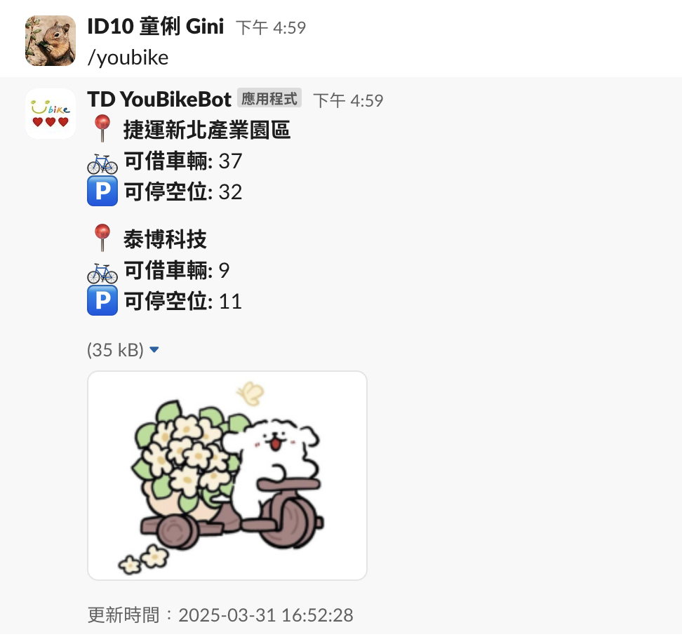

## TD YouBikeBot

#### TD YouBikeBot is a Slackbot built with Next.js that provides real-time YouBike station information. This Slack app is deployed on Vercel and can be accessed via the Slash Command /youbike.

### Features

- Real-Time Data: Fetches YouBike station data from the NTPC open data API.

- Slack Integration: Provides an interactive Slack Slash Command /youbike that returns station details including available bikes, parking slots, and the last update time.

- Customizable UI: Displays messages using Slack's Block Kit with text, accessory images, and context blocks for smaller update time fonts.

### Project Structure

- /app/api/slack/youbike/route.ts

  - Contains the API route to handle incoming POST requests from the Slack Slash Command. It fetches YouBike data from the NTPC API, formats the response, and returns it to Slack.

- /app/api/youbike/route.ts
  - Provides a GET endpoint to retrieve YouBike station data in JSON format.

### Technologies Used

- Next.js: For building the serverless API routes.

- Vercel: For deploying the project with automatic builds and hosting.

- Slack API: For creating the Slack App and configuring the Slash Command.

- NTPC Open Data API: Source for YouBike station data.

### Setting Up the Slack App

1. Create Your Slack App:

   - Visit https://api.slack.com/apps and click Create New App.

   - Give your app a name (e.g., "TD YouBikeBot") and select your workspace.

2. Configure the Slash Command:

   - In your app's settings, navigate to Slash Commands and click Create New Command.

   - Set the Command to /youbike.

   - In the Request URL field, enter: https://youbike-info.vercel.app/api/slack/youbike

   - Provide a short description (YouBike 即時報導 ꜀(^. .^꜀ )꜆੭).

3. Set OAuth & Permissions:

   - Under OAuth & Permissions, ensure your bot has the necessary Bot Token Scopes:

     - commands

     - chat:write
